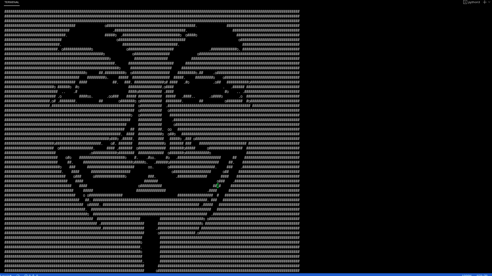

# translate_photo_to_symbols

Конвертирование изображения в символы

> Install 
```
git clone https://github.com/YuranIgnatenko/translate_photo_to_symbols.git
```
***

> Пример использования:
``` py
t = Transform()

name_image = "image.png" //.jpeg // .jpg // ..

t.create_console_invert(name_image, width_image_in_px)
t.create_console(name_image, width_image_in_px)
t.create_console_color(name_image, width_image_in_px)

input()
```

***

Также есть возможность доработать или изменить на своё усмотрение.
Вы можете запустить анимацию из набора данных.

***
> Example
``` py
list_image = ['im1.png','im2.png','im3.png','im4.png', 'im5.png']
t = Transform()
t.animation_console(list_imgage, fps=0.5, loop_count=0, width=200)
```
***
> Demo screen
***



 ***